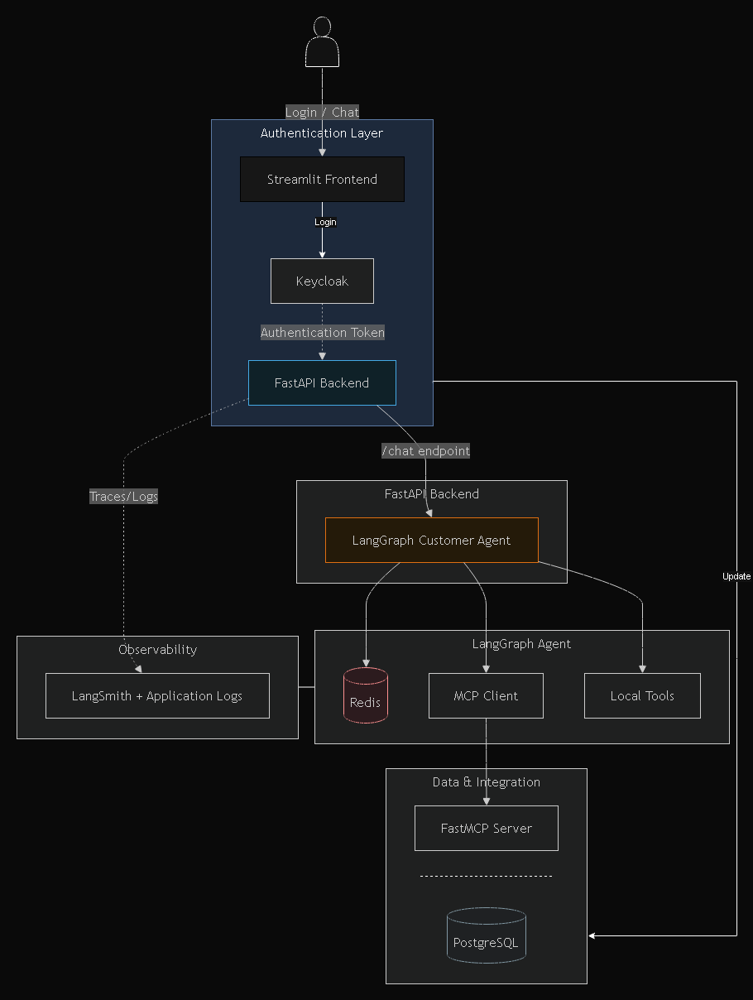

# ACME Customer Support Agent


---

## Table of Contents

- [Project Overview](#project-overview)
- [Key Features](#key-features)
- [System Architecture](#system-architecture)
- [Technology Stack](#technology-stack)
- [Quick Start](#quick-start)
- [Running the Application](#running-the-application)
- [Demo Users](#demo-users)
- [Solution Architecture](#solution-architecture)
- [Evaluation Summary](#evaluation-summary)
- [AI Tool Usage Summary](#ai-tool-usage-summary)
- [Future Improvements](#future-improvements)

# Project Overview

The ACME Customer Support Agent is an AI-powered customer support application that combines conversational AI with enterprise backend services to help support teams retrieve customer information, investigate issues, recommend next actions, and generate executive escalation summaries.

The solution is designed around a modular architecture that separates conversational reasoning, business capabilities, authentication, persistence, and observability into independent components. The application uses a LangGraph agent to orchestrate tool execution, a custom Model Context Protocol (MCP) server to expose business functionality, PostgreSQL as the system of record, Redis for conversation memory, and Keycloak for authentication and role based access control.

The project demonstrates several enterprise AI engineering concepts, including:

- Secure authentication using Keycloak and JWT validation
- Role-Based Access Control (RBAC)
- Dynamic tool selection using LangGraph
- Model Context Protocol (MCP) integration
- Grounded responses using PostgreSQL data
- Conversation memory using Redis-backed LangGraph checkpoints
- Structured logging, latency tracking, and LangSmith observability
- Fully containerised deployment using Docker Compose

---

# Key Features

- LangGraph-based conversational AI agent
- Custom MCP server exposing customer support business tools
- Keycloak authentication with JWT validation
- Role-Based Access Control (`sales_user`, `support_user`, `admin`)
- PostgreSQL for customer, issue, issue history and next action management
- Redis conversation memory using LangGraph Async Checkpointer
- Executive Customer Escalation Summary skill
- LangSmith integration and structured application logging
- Docker Compose deployment


# System Architecture

The application follows a modular service-oriented architecture where each component has a clearly defined responsibility.

- **Streamlit** provides the user interface and authenticates users through Keycloak.
- **FastAPI** exposes REST APIs, validates JWT tokens, enforces role-based access control, and coordinates requests.
- **LangGraph** orchestrates the conversational workflow and dynamically selects the appropriate tools to answer user queries.
- **Model Context Protocol (MCP)** exposes reusable business capabilities such as customer lookup, issue retrieval, and recommended next actions.
- **PostgreSQL** acts as the system of record for customer support data.
- **Redis** stores LangGraph conversation checkpoints, allowing conversations to resume efficiently across requests.
- **LangSmith** and structured application logging provide tracing, tool execution visibility, error logging, and latency tracking.





---

# Technology Stack

| Component | Technology |
|-----------|------------|
| Frontend | Streamlit |
| Backend API | FastAPI |
| AI Agent | LangGraph |
| LLM | OpenAI GPT-4.1 Mini |
| MCP | FastMCP |
| Authentication | Keycloak |
| Database | PostgreSQL |
| Conversation Memory | Redis |
| ORM | SQLAlchemy |
| Observability | LangSmith, Python Logging |
| Containerisation | Docker & Docker Compose |

---

# Quick Start

## Prerequisites

Before running the project, ensure the following software is installed:

- Docker Desktop
- Docker Compose
- Git

The application has been designed to run entirely using Docker Compose, with no additional local dependencies required.

---

# Running the Application

Clone the repository:

```bash
git clone <repository-url>
cd acme-agent
```

Start all services:

```bash
docker compose up --build
```

Once the containers have started, the application will be available at:

| Service | URL |
|----------|-----|
| Streamlit UI | http://localhost:8501 |
| FastAPI | http://localhost:8000 |
| FastAPI Swagger | http://localhost:8000/docs |
| Keycloak | http://localhost:8080 |
| MCP Server | http://localhost:8001/mcp |

---

# Project Structure

```text
acme-agent/
│
├── app/                 # FastAPI backend and LangGraph agent
├── frontend/            # Streamlit user interface
├── mcp_server/          # MCP server exposing business tools
├── docs/                # Documentation
├── docker-compose.yml
├── Dockerfile.api
├── Dockerfile.streamlit
└── README.md
```


---

# Demo Users

The application uses Keycloak for authentication and role-based access control. The following demo users are available for testing.

| Username | Role | Permissions |
|----------|------|-------------|
| alice.support | support_user | View customers, view issues, update issue status |
| bob.sales | sales_user | Read only access to customer and issue information |
| admin.user | admin | Full access including creating recommended next actions |

> Authentication is performed through the Streamlit login screen. JWT tokens are issued by Keycloak and automatically included in all subsequent API requests.

---

# Solution Architecture

The solution has been designed around a modular architecture where each component has a single responsibility. This separation makes the application easier to maintain, test, and extend while keeping business logic independent from the conversational AI layer.

## AI Agent (LangGraph)

The conversational workflow is orchestrated using LangGraph.

Rather than responding directly from the language model, the agent analyses each user request and dynamically determines whether additional information is required from backend tools before generating a final response.

The agent currently supports:

- Customer lookup
- Open issue retrieval
- Issue history retrieval
- Recommended next action retrieval
- Executive escalation summary generation

Conversation state is maintained using Redis backed LangGraph checkpoints, allowing the agent to preserve conversational context across requests.

---

## Model Context Protocol (MCP)

Business functionality is exposed through a custom FastMCP server.

Instead of allowing the AI agent to communicate directly with the database, the agent invokes MCP tools which encapsulate business logic behind a well defined interface.

The current MCP tools include:

- Customer Lookup
- Open Customer Issues
- Issue History
- Recommended Next Action


Additional business capabilities remain implemented as local LangGraph tools where direct application integration is more appropriate, demonstrating that the architecture can combine both MCP and native tools within a single agent workflow.

This approach keeps the AI orchestration layer independent from backend implementation details and makes future expansion straightforward.

---

## Authentication & Role-Based Access Control

Authentication is implemented using Keycloak.

Users authenticate through the Streamlit interface, after which a JWT access token is issued and attached to all API requests.

The FastAPI backend validates every incoming token before processing requests.

Role Based Access Control (RBAC) is enforced on protected endpoints using the authenticated user's assigned Keycloak role.

The following roles are implemented:

- **sales_user**
  - Read customer information
  - View issues

- **support_user**
  - Read customer information
  - View issues
  - Update issue status

- **admin**
  - Full system access
  - Create recommended next actions
  - Update issue status


  ---

## PostgreSQL

PostgreSQL serves as the system of record for the application and stores all business data required by the customer support workflow.

The database contains structured information including:

- Customers
- Customer Issues
- Issue Update History
- Recommended Next Actions

Unlike the conversational memory maintained by Redis, PostgreSQL stores durable business entities that must remain consistent, queryable, and auditable. Every AI-generated response that references customer information or issue details is grounded using data retrieved from PostgreSQL through application services or MCP tools.

Separating business data from conversational state ensures that transactional information remains reliable while allowing the AI layer to remain stateless with respect to permanent business records.

---

## Redis Conversation Memory

Redis is used as the conversation memory store for the LangGraph agent.

Rather than storing business information, Redis maintains LangGraph checkpoints that capture the conversational state for each authenticated user. These checkpoints allow conversations to continue across multiple requests without repeatedly sending the entire conversation history to the language model.

Each authenticated user is assigned an independent conversation thread, allowing conversation context to remain isolated between users while preserving previous interactions within the same session.

To prevent conversation data from growing indefinitely, checkpoints are configured with an automatic expiration period (TTL). Active conversations refresh their expiry time whenever they are accessed, while inactive conversations are automatically removed after the configured retention period.

This design keeps Redis focused on short-lived conversational context while PostgreSQL remains the authoritative source for business data.

---

## Observability

The application includes structured observability to support debugging, monitoring, and evaluation of the AI workflow.

Observability includes:

- Structured request and response logging
- Tool invocation logging
- LangGraph execution tracing
- Error logging
- Request latency tracking
- LangSmith traces for LLM interactions and tool execution

Each incoming request is assigned a clear execution path through the application, making it straightforward to identify authentication failures, tool execution, database access, and language model interactions.

This level of observability assists both development and operational troubleshooting while also supporting evaluation of agent behaviour.

---

## Design Decisions & Trade-offs

Several architectural decisions were made to balance simplicity, maintainability, and extensibility within the scope of the assessment.

### LangGraph

LangGraph was selected to orchestrate tool execution and conversation state because it provides a clear separation between reasoning and business logic while supporting persistent conversation memory.

### Model Context Protocol (MCP)

Customer lookup and issue retrieval are exposed through an MCP server to demonstrate a modular service oriented architecture. Additional application specific capabilities remain implemented as local tools where tighter integration with the backend is more appropriate.

### PostgreSQL vs Redis

Business entities are stored in PostgreSQL because they require durability and transactional consistency.

Redis is used exclusively for conversation checkpoints, allowing temporary conversational context to be managed independently of permanent business data.

### Keycloak

Keycloak provides standards based authentication and role management without requiring custom authentication logic within the application. This keeps authentication concerns separated from application business logic while supporting JWT validation and role-based access control.

### Asynchronous Design

The FastAPI application, LangGraph agent, MCP integration, PostgreSQL access, and Redis conversation memory are implemented using asynchronous operations. This allows the application to handle concurrent requests efficiently while waiting on network or database operations.

---

# Evaluation Summary

The solution was evaluated against a representative set of customer support scenarios covering conversational retrieval, tool selection, role-based access control, and recommendation generation.

The evaluation focused on verifying that:

- The LangGraph agent selected the appropriate local or MCP tool's for each request.
- Responses were grounded using PostgreSQL data rather than generated from the language model alone.
- Role Based Access Control (RBAC) was correctly enforced for all protected operations.
- Recommended next actions were appropriate for the customer's issue context.
- Observability captured tool execution, request traces, latency, and errors throughout the workflow.

Detailed evaluation scenarios and results are available in:

> `docs/evaluation_test_set.xlsx`

---

# AI Tool Usage Summary

AI coding assistants were used throughout development as an engineering aid to explore implementation approaches, review code structure, and improve documentation.

All AI generated suggestions were reviewed, validated, tested, and adapted before being incorporated into the solution. Particular attention was given to authentication, security, asynchronous execution, and third party library behaviour to ensure compatibility with the selected technology stack.

A detailed account of AI usage, validation, and engineering decisions is available in:

[AI Usage Notes](docs/ai_usage.md).
---

# Future Improvements

Given additional development time, the following enhancements would be considered:

- Expand the MCP server to expose additional business capabilities.
- Introduce semantic retrieval for knowledge base style documentation alongside structured database queries.
- Implement conversation summarisation for very long running conversations.
- Add automated integration and end to end testing.
- Introduce metrics dashboards using OpenTelemetry.
- Extend role management with finer grained permissions.
- Support multi-session conversation history per user.

---
